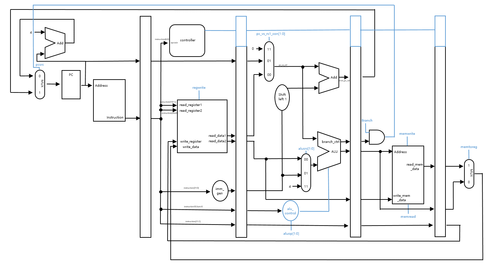

# RISC-V CPU Project (A.K.A WSC)

## Goal

- Sorting algorithm 동작 가능한 CPU 설계

 - ISA :  RV32I 

- 구직 포트폴리오 제출용

## Features
 ### 5 stage pipelined CPU
 IF,ID,EXE,MEM,WB

### Pipeline harzard handling
- Data Hazard : Forwarding & stalling (Not yet updated)
- Control Hazard : Branch not taken (Not yet updated)

### 지원 명령어
|  |  |  |  |  |  |  |  |  |  |  |
|--|--|--|--|--|--|--|--|--|--|--|
| ADD | SUB | SLL | SLT | SLTU | XOR | SRL | SRA | OR | AND |
| ADDI | SLTI | SLTIU | XORI | ORI | ANDI | SLLI | SRLI | SRAI |
| LB | LH | LW | LBU | LHU | 
| JALR | JAR |
| SB | SH | SW |
| BEQ | BNE | BLT | BGE | BLTU | BGEU |
| LUI | AUIPC|
|  |  |  |  |  |  |  |  |  |  |  |

## Overall Schematic 
### V2.00

## Verification Method
### 개별 명령어 입력
- ADD,SUB, .... 명령어를 intruction  memory에 넣은 후 VIvado Simulation을 통해 확인
- Pipeline register 값 확인
### 정렬 알고리즘 수행
- bubble sort , merge sort를 수행하고 결과 확인
## Current Version
### V 1.00 (2024-11-14)
	- 프로젝트 생성 
### V 2.00 (2025-1-16)
	- 1차 업데이트
	- Goal 변경 : 운영체제 탑제 CPU -> 정렬 알고리즘 수행
	- IF/ID/EXE/MEM/WB 모듈 설계 완료
	- 컨트롤러 설계완료
	- 검증 x 
## Reference

> Sarah Harris, David Harris - Digital Design and Computer Architecture,  RISC-V Edition_ RISC-V Edition (2021, Morgan Kaufmann)
