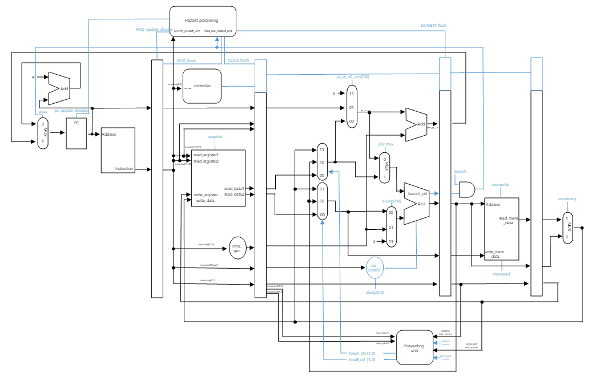

# RISC-V CPU Project (A.K.A WSC)

## Goal

- Sorting algorithm 동작 가능한 CPU 설계

 - ISA :  RV32I 

- 구직 포트폴리오 제출용

## Features
 ### 5 stage pipelined CPU
 IF,ID,EXE,MEM,WB

### Pipeline harzard handling
- Data Hazard : Forwarding & stalling
- Control Hazard : Branch not taken

### 지원 명령어
|  |  |  |  |  |  |  |  |  |  |  |
|--|--|--|--|--|--|--|--|--|--|--|
| ADD | SUB | SLL | SLT | SLTU | XOR | SRL | SRA | OR | AND |
| ADDI | SLTI | SLTIU | XORI | ORI | ANDI | SLLI | SRLI | SRAI |
| LB | LH | LW | LBU | LHU | 
| JALR | JAR |
| SB | SH | SW |
| BEQ | BNE | BLT | BGE | BLTU | BGEU |
| LUI | AUIPC|
|  |  |  |  |  |  |  |  |  |  |  |

## Overall Schematic 

## Verification Method
### 개별 명령어 입력
 1. ADD,SUB, .... 명령어를 intruction  memory에 넣은 후 VIvado Simulation을 통해 확인
	 - test001.txt : add sub 등 
	 - test002.txt : save load 등
	 - test003.txt : branch 등
	 - test004.txt : jal, jalr 등
	 
### 정렬 알고리즘 수행
 2. bubble sort , merge sort를 수행하고 결과 확인
	- sort.txt: 5 2 8 1 9 -> sort -> 1 2 5 8 9

## How to verify

- 미리 만들어둔 test_bench File로 직접 검증 가능.

- Test001 ~ Test004 : Instruction_Memory.v 파일 내 readmemh의 txt를 Test00x.txt
					  Data_Memory.v 파일 내의 readmemh의 txt를 default.txt로 변환
					  
- bubble_Sort : Instruction_Memory.v 파일 내 readmemh의 txt를 Sort.txt
				Data_Memory.v 파일 내의 readmemh의 txt를 Sort_data.txt로 변환

## Sorting Result

## Current Version
### V 1.00 (2024-11-14)
	- 프로젝트 생성 
### V 2.00 (2025-01-16)
	- 1차 업데이트
	- Goal 변경 : 운영체제 탑제 CPU -> 정렬 알고리즘 수행
	- IF/ID/EXE/MEM/WB 모듈 설계 완료
	- 컨트롤러 설계완료
	- 검증 x 
### V 2.10 (2025-02-03)
	- hazard 처리 모듈 설계
	- arithmatic 명령어 verified & load save 명령어 검증 (Test001, Test002) 
	- conditional & unconditional jump 검증 예정
### V2.20 (2025-02-04)
	- conditional & unconditional jump 검증 (Test003, Test004)
### V2.30 (2025-02-10)
	- bubble sort testbench 작성 및 검증

## Tool
 1. ***AMD Vivado***
 2. ***RISC-V online assembler (https://riscvasm.lucasteske.dev/#)*** 
 	
## Reference

> David A. Patterson, John L. Hennessy - Computer Organization and Design_ The Hardware Software Interface [RISC-V Edition]

> RISC-V Official Manual : (https://riscv.org/specifications/ratified/)

>Bubble sort assembly Code : (https://marz.utk.edu/my-courses/cosc230/book/example-risc-v-assembly-programs/#bubble_sort)

